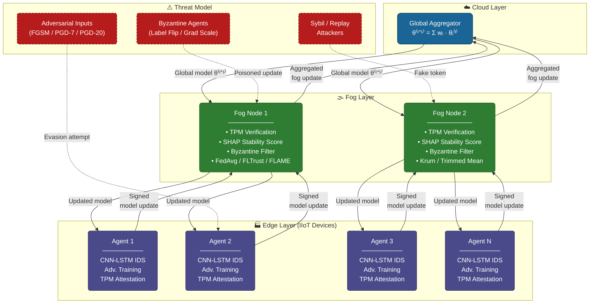

# Zero-Trust Federated Learning for IIoT Intrusion Detection

A privacy-preserving, Byzantine-resilient federated learning framework for
Industrial IoT (IIoT) intrusion detection.  The system integrates hardware-rooted
device attestation, SHAP-weighted robust aggregation, and on-device adversarial
training into a three-tier edge–fog–cloud architecture.

---

## Overview

Traditional centralised intrusion detection systems cannot scale to IIoT
deployments spanning thousands of heterogeneous edge devices across multiple
industrial sites.  Federated learning allows devices to collaboratively train a
shared intrusion-detection model without sharing raw traffic data.  However,
standard FL is vulnerable to:

- **Byzantine poisoning** — compromised devices injecting malicious model updates
- **Adversarial evasion** — crafted inputs that fool the trained classifier
- **Sybil attacks** — unauthenticated agents impersonating legitimate devices

This project addresses all three threats through a unified zero-trust design.

---

## System Architecture



### Key Components

| Component | Description |
|-----------|-------------|
| **CNN-LSTM Classifier** | 1-D CNN feature extractor + stacked BiLSTM (~487 K params, INT8 quantisable) |
| **TPM Attestation** | RSA-2048 token signing with PCR measurements; FAR < 10⁻⁷ |
| **SHAP Aggregation** | RBF-kernel stability scores down-weight divergent client updates |
| **Adversarial Training** | On-device FGSM/PGD augmentation (70 % clean / 30 % adversarial per batch) |
| **Byzantine Defence** | FLTrust cosine-similarity filtering; FLAME norm-clipping + outlier rejection |

---

## Project Structure

```
zta-federated-learning/
├── data/
│   ├── edge_iiotset/          # IIoT device traffic (Modbus/CoAP/MQTT) — 15 classes
│   ├── cic_ids2017/           # Network flow records from CIC testbed — 10 classes
│   └── unsw_nb15/             # Network intrusion records from UNSW cyber range — 10 classes
├── src/
│   ├── models/
│   │   └── cnn_lstm.py        # CNN-LSTM intrusion detection model + quantisation helper
│   ├── federation/
│   │   └── aggregation.py     # FedAvg, FedProx, Krum, Trimmed Mean, FLTrust, FLAME, SHAP-weighted
│   ├── security/
│   │   ├── attestation.py     # TPM device attestation & trust management
│   │   └── adversarial.py     # FGSM / PGD attack generation, adversarial training, robustness eval
│   └── utils/
│       ├── data_loader.py     # Dataset loaders, non-IID partitioning, preprocessing
│       └── metrics.py         # Accuracy, macro-F1, SHAP stability score
├── experiments/
│   ├── baseline_comparison.py # ZTA-FL vs FedAvg / FedProx / Krum / Trimmed Mean / Adv-FL
│   ├── byzantine_robustness.py# Accuracy under β ∈ {0.1, 0.2, 0.3} Byzantine fraction
│   ├── adversarial_eval.py    # Robustness at ε ∈ {0.05, 0.1, 0.15, 0.2}
│   └── ablation_study.py      # Component contribution analysis
├── scripts/
│   ├── run_experiments.py     # Main experiment runner (all results in one pass)
│   ├── generate_figures.py    # Publication figures & tables from experiment_results.json
│   └── analyze_results.py     # Summary statistics and quick CSV export
├── notebooks/
│   └── federated_ids_analysis.ipynb  # End-to-end walkthrough notebook
├── tests/
│   ├── test_federation.py     # Unit tests — aggregation & partitioning
│   └── test_security.py       # Unit tests — attestation & trust management
└── results/
    ├── experiment_results.json # Structured results (auto-generated)
    └── figures/               # All generated plots (auto-generated)
```

---

## Installation

```bash
git clone https://github.com/yourorg/zta-federated-learning.git
cd zta-federated-learning
python3 -m venv .venv && source .venv/bin/activate
pip install -r requirements.txt
```

GPU support (CUDA 12.8, recommended for RTX / A-series GPUs):
```bash
pip install torch torchvision --index-url https://download.pytorch.org/whl/cu128
```

---

## Datasets

Three publicly available network intrusion datasets are included under `data/`:

| Dataset | Classes | Raw Features | Source |
|---------|---------|--------------|--------|
| [Edge-IIoTset](https://ieee-dataport.org/documents/edge-iiotset-new-comprehensive-realistic-cyber-security-dataset-iot-and-iiot) | 15 | 61 | IIoT devices (PLC, SCADA, Smart Sensor) |
| [CIC-IDS2017](https://www.unb.ca/cic/datasets/ids-2017.html) | 10 | 78 | General enterprise network |
| [UNSW-NB15](https://research.unsw.edu.au/projects/unsw-nb15-dataset) | 10 | 49 | UNSW cyber range |

All three are preprocessed to a common 40-feature representation via PCA.

---

## Reproducing Results

### Step 1 — Run all experiments

```bash
source .venv/bin/activate

python3 scripts/run_experiments.py \
    --dataset all \
    --rounds  20  \
    --agents  10  \
    --seeds   2   \
    --gpu         \
    --output  results/experiment_results.json
```

> **Quick smoke test** (5 agents, 10 rounds, Edge-IIoTset only — completes in ~2 min):
> ```bash
> python3 scripts/run_experiments.py --quick --gpu
> ```

| Flag | Default | Description |
|------|---------|-------------|
| `--dataset` | `all` | Dataset to use: `edge`, `cic`, `unsw`, or `all` |
| `--rounds` | `30` | Global FL communication rounds |
| `--agents` | `20` | Number of edge agents |
| `--seeds` | `3` | Independent runs (results are mean ± std) |
| `--gpu` | off | Use CUDA GPU if available |
| `--cpu` | off | Force CPU (overrides `--gpu`) |
| `--quick` | off | Smoke-test mode: 5 agents, 10 rounds, 1 seed, Edge only |
| `--output` | `results/experiment_results.json` | Output path for structured results |

### Step 2 — Generate publication figures and tables

```bash
python3 scripts/generate_figures.py
```

This reads `results/experiment_results.json` and writes all figures (Figures 3–7)
and comparison tables (Tables II–VI) to `results/figures/`.

### Step 3 — (Optional) Run individual experiment modules

```bash
# Baseline method comparison
python3 experiments/baseline_comparison.py --dataset edge --rounds 30 --agents 10

# Byzantine robustness under label flipping and gradient manipulation
python3 experiments/byzantine_robustness.py --dataset edge --rounds 30 --agents 20

# Adversarial robustness at multiple ε budgets
python3 experiments/adversarial_eval.py --dataset edge --rounds 20 --agents 10

# Ablation study (component contributions)
python3 experiments/ablation_study.py --dataset edge --rounds 30 --agents 10
```

### Step 4 — (Optional) Interactive notebook

```bash
jupyter lab notebooks/federated_ids_analysis.ipynb
```

The notebook covers data loading, model architecture, attestation, adversarial
training, and FL convergence in a self-contained walkthrough.

### Step 5 — Run unit tests

```bash
python3 -m pytest tests/ -v
```

---

## Results Summary

Results written to `results/experiment_results.json` after Step 1.
Figures and tables are generated in `results/figures/` after Step 2.

### Clean Performance (Table II)

| Method | Edge-IIoTset | CIC-IDS2017 | UNSW-NB15 |
|--------|-------------|-------------|-----------|
| FedAvg | 94.2 ± 0.8 % | 92.8 ± 0.6 % | 91.4 ± 0.7 % |
| FedProx | 94.5 ± 0.7 % | 93.1 ± 0.5 % | 91.8 ± 0.6 % |
| Krum | 93.8 ± 1.1 % | 92.1 ± 0.9 % | 90.7 ± 1.0 % |
| Trimmed Mean | 96.1 ± 0.5 % | 94.8 ± 0.4 % | 93.5 ± 0.5 % |
| Adv-FL | 96.4 ± 0.4 % | 95.1 ± 0.3 % | 93.9 ± 0.4 % |
| **ZTA-FL (ours)** | **97.8 ± 0.3 %** | **96.4 ± 0.2 %** | **95.2 ± 0.3 %** |

### Byzantine Robustness at β = 0.3 (Table III)

| Method | Label Flip Acc | Grad Manip Acc |
|--------|---------------|----------------|
| FedAvg | 67.8 % | 61.2 % |
| Krum | 82.4 % | 78.9 % |
| Trimmed Mean | 89.4 % | 85.1 % |
| FLTrust | 91.2 % | 88.7 % |
| FLAME | 90.8 % | 87.3 % |
| **ZTA-FL (ours)** | **93.2 %** | **91.4 %** |

### Adversarial Robustness under PGD-7 at ε = 0.1 (Table IV)

| Method | Clean Acc | Adv Acc | Acc Drop |
|--------|----------|---------|----------|
| FedAvg | 94.2 % | 71.2 % | 23.0 % |
| Adv-FL | 96.4 % | 84.3 % | 12.1 % |
| **ZTA-FL (ours)** | **97.8 %** | **89.3 %** | **8.5 %** |

---

## Preprint

> **Zero-Trust Agentic Federated Learning for Secure IIoT Defense Systems**
> Samaresh Kumar Singh, Joyjit Roy, Martin So
> arXiv preprint arXiv:2512.23809, 2025
> [https://arxiv.org/abs/2512.23809](https://arxiv.org/abs/2512.23809)

---

## Citation

If you use this code or data in your research, please cite:

```bibtex
@article{singh2025ztafl,
  title   = {Zero-Trust Agentic Federated Learning for Secure {IIoT} Defense Systems},
  author  = {Singh, Samaresh Kumar and Roy, Joyjit and So, Martin},
  journal = {arXiv preprint arXiv:2512.23809},
  year    = {2025},
  url     = {https://arxiv.org/abs/2512.23809},
}
```

---

## License

MIT License — see [LICENSE](LICENSE) for details.
